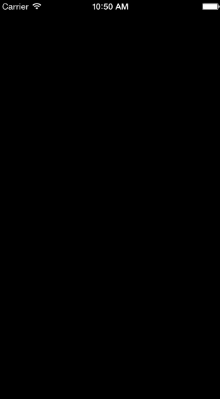

# DDProgressView

DDProgressView is a colorful progressView with a animation.

## Usage

Copy `DDProgressView .h / .m` to your project. Call the setProgress...method like the ‘DDGrandientLayer_VC’.

## Author

SanLiangSan:

- Email: <254458886@qq.com>